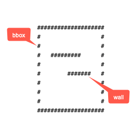

```
####################
#              .B  #
#             .    #
#   #########.     #
#    ........      #
#   .    #######   #
#  .               #
# A                #
#                  #
####################
```
# asciimap
asciimap builds an ASCII map from a geojson file. The ascii map can be used for [astar](https://github.com/shanghuiyang/astar) project.

## Usage
```
Application Options:
  -f, --geojson-file=FILENAME    Input geojson file name(required)
  -g, --grid-size=GRIDSIZE       Grid size (default: 0.00001)
  -m, --map-file=MAPFILE         Output map file (default: map.txt)

Help Options:
  -h, --help                     Show this help message
```
an example,
```shell
$ asciimap -f map.geojson -g 0.00001 -m map.txt
```

### Create the GeoJSON
#### elements
there are two element types for an ascii map.
* `bbox`: the boundary box of a map.
* `wall`: the wall which a routing can't go through.



#### how to draw the geojson?
1. go to your favorite geojson editor such as [geojson.io](http://geojson.io/#map=2/20.0/0.0) or [tomscholz](https://tomscholz.github.io/geojson-editor).
2. draw a polygon which will be used for bbox. Add `"isbbox": true` to `properties`. There should be only one bbox for an ascii map.
4. continue to draw polygons which will be used for walls.

see [map.geojson](/map.geojson) for an example. I drew it using [tomscholz](https://tomscholz.github.io/geojson-editor) geojson editor agaist satellite. [map.txt](/map.txt) is its ascii map as the result.


