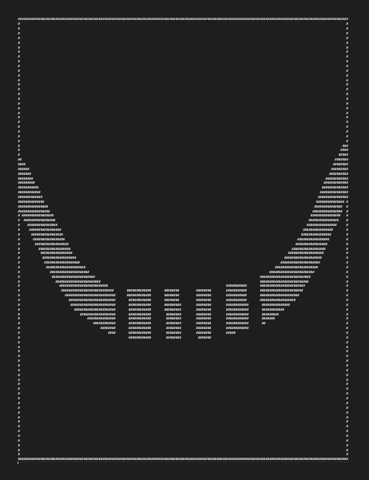

```
####################
#              .B  #
#             .    #
#   #########.     #
#    ........      #
#   .    #######   #
#  .               #
# A                #
#                  #
####################
```
# asciimap
[](https://github.com/shanghuiyang/asciimap/actions/workflows/ci.yml)
[](https://github.com/shanghuiyang/asciimap/blob/main/LICENSE)

asciimap builds an ASCII map from a geojson file. The ascii map can be used for [astar](https://github.com/shanghuiyang/astar) project.

## Usage
```
usage: asciimap [<flags>] <geojson-file>

Flags:
  -h, --help                Show context-sensitive help (also try --help-long and --help-man).
  -g, --grid-size=0.00001   Grid size
  -m, --map-file="map.txt"  Output map file

Args:
  <geojson-file>  Input geojson file name(required)
```

examples,
```shell
# generate ascii map from map.geojson using default grid-size and map-file.
$ asciimap map.geojson

# or, specify grid-size and ouput map-file.
$ asciimap map.geojson -g 0.00002 -m yourmap.txt
```

### Create the GeoJSON
#### elements
there are two element types for an ascii map.
* `bbox`: the boundary box of a map.
* `wall`: the wall which a routing can't go through.


#### how to draw the geojson?
1. go to your favorite geojson editor such as [geojson.io](http://geojson.io/#map=2/20.0/0.0) or [tomscholz](https://tomscholz.github.io/geojson-editor).
2. draw a polygon which will be used for bbox. Add `"isbbox": true` to `properties`. There should be only one bbox for an ascii map.
4. continue to draw polygons which will be used for walls.

see [map.geojson](/map.geojson) for an example. I drew it using [tomscholz](https://tomscholz.github.io/geojson-editor) geojson editor agaist satellite. [map.txt](/map.txt) is its ascii map as the result.



